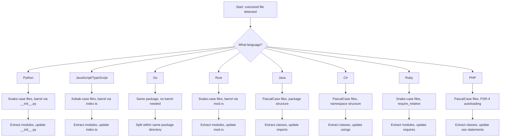

# File Splitting Guide — Language-Specific Reference

> **Canonical reference.** Each skill that uses this reference has a skill-specific introductory paragraph; the content below is shared identically across all skills. Edit this file to update the shared content, then run `_shared/scripts/sync-references.sh` to sync to all skills.

> **Skill-specific intro template:** "When the `<skill-name>` skill <detects/identifies> that a file is oversized (>400 lines) or will cross that threshold, this guide provides **language-specific mechanics** for splitting it correctly."

**Load this reference when:** A skill recommends splitting an oversized file and you need to determine the mechanics (import changes, module structure, before/after examples).

---

## Universal Principles (Any Language)

These principles apply regardless of stack:

1. **Preserve the public API** — External consumers of the file should find the same exports/symbols after the split (use barrel files/re-exports when needed).
2. **One module per concern** — Extract code by natural boundaries: classes, functions, comment-section headers, import-group clusters.
3. **Prefer same-directory over subdirectory** — Keep extracted files in the same directory unless 3+ files are extracted or a clear domain boundary emerges.
4. **Match existing conventions** — Use the project's detected naming convention (snake_case, kebab-case, PascalCase) for new files.
5. **Update all references** — Every file that imported from the original must be updated. Use code-search tools to find them all.
6. **Test before and after** — Write a test capturing the public API before splitting, verify it passes after splitting.
7. **No cross-directory packages in Go** — Go requires all files in a package to be in the same directory. Splitting a Go file means keeping the same package.

---

## Decision Flowchart

Follow this decision tree for each oversized file:

