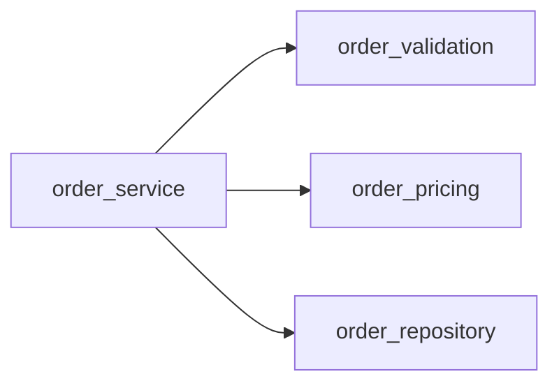
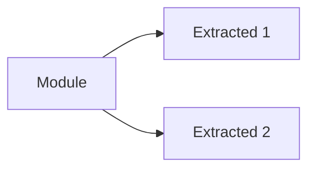

# Audit Codebase — Reference

Detailed reference for the `audit-codebase` skill. Loaded on demand when the agent needs depth beyond the SKILL.md.

For **language-specific organization patterns** (Go, Java, Python, JS/TS, Rust, Ruby, C#, PHP), see [ORGANIZATION-PATTERNS.md](ORGANIZATION-PATTERNS.md).

---

## Metric Deep Dives

### 1. Folder File Count

**Threshold:** >30 files per directory (Warning)

**Why 30:** Beyond 30 files, developers start losing track of what lives where. Scrolling becomes tedious, and file discovery relies on search rather than navigation.

**Language-agnostic example:**

```
Location: `src/utils/` (or `lib/utils/`, `app/helpers/`)
Metric: 47 files
Threshold: ≤30 files
Severity: Warning
Recommended action: Split into subdirectories by domain/module
  src/utils/
  ├── string-helpers/     (string manipulation)
  ├── date-helpers/       (date/time utilities)
  ├── network/            (HTTP, API helpers)
  └── validators/         (input validation)
```

**Before (ASCII tree):**

```
src/utils/
├── string_utils.py
├── date_formatter.js
├── http_client.go
├── validator.py
└── ... and 43 more
```

**After (ASCII tree):**

```
src/utils/
├── string-helpers/
├── date-helpers/
├── network/
└── validators/
```

**Tip:** When suggesting subdirectory splits, use the project's existing naming convention (kebab-case, snake_case, etc.). See [ORGANIZATION-PATTERNS.md](ORGANIZATION-PATTERNS.md) for language-specific conventions.

---

### 2. File Line Count

**Threshold:** >400 lines per file (Warning)

**Why 400:** Files beyond 400 lines typically mix multiple concerns. They're harder to review, test, and maintain. Breaking them into modules improves locality and testability.

**What to look for (any language):**

- Files with many imports (often a sign of too many dependencies)
- Files with multiple class/function/struct definitions that could be split
- Files with both business logic AND I/O AND error handling mixed together

**Language-agnostic example:**

```
Location: `src/services/order_service.py` or `internal/order/service.go`
Metric: 887 lines
Threshold: ≤400 lines
Severity: Warning
Recommended action: Split by responsibility:
  - order_service.py         (orchestration, ~150 lines)
  - order_validation.py      (validation rules, ~100 lines)
  - order_pricing.py         (pricing logic, ~100 lines)
  - order_repository.py      (data access, ~80 lines)
```

**Mermaid dependency diagram (file-level):**



---

### 3. Nesting Depth

**Threshold:** >4 levels of directory nesting (Warning)

**Why 4:** Deep nesting increases cognitive load when navigating. Developers need to remember more context about where they are in the tree. Flat structures are easier to reason about.

**Measuring depth (language-agnostic):**
Deep nesting often happens with package/namespace conventions:

```
src/                        ← level 1
  └── main/                 ← level 2
      └── java/             ← level 3
          └── com/          ← level 4
              └── company/  ← level 5 ← FLAGGED
```

Or in deeply nested feature folders:

```
app/                                ← level 1
  └── modules/                      ← level 2
      └── admin/                    ← level 3
          └── settings/             ← level 4
              └── permissions/      ← level 5 ← FLAGGED
                  └── roles/        ← level 6
```

**Fix:** Flatten by domain rather than by namespace. Merge related modules:

```
src/
  ├── billing/
  ├── users/
  ├── inventory/
  └── notifications/
```

---

### 4. Naming Conventions

**Threshold:** Mixed casing styles at the same level (Suggestion)

**Common naming styles across languages:**

| Style      | Example            | Typical Language                           |
| ---------- | ------------------ | ------------------------------------------ |
| kebab-case | `user-profile.ts`  | Files/dirs in JS, Vue, web projects        |
| snake_case | `user_profile.py`  | Python (PEP 8), Rust, Ruby files           |
| camelCase  | `userProfile.ts`   | JavaScript/TypeScript variables            |
| PascalCase | `UserProfile.tsx`  | React components, C# classes, Java classes |
| UPPER_CASE | `CONFIG_VALUES.ts` | Constants across all languages             |

**What to flag:**

```
Location: `src/`
Issue: Mixed naming styles detected:
  - userProfile.ts (camelCase)
  - user_profile.py (snake_case)
  - user-profile.ts (kebab-case)
Recommended action: Standardize on one convention
```

---

### 5. Orphaned / Misplaced Files

**Threshold:** Files whose purpose doesn't match parent directory (Warning)

**Common patterns (language-agnostic):**

- A `.py` / `.js` / `.go` / `.rs` source file inside `images/` directory
- Database config inside `components/` or `views/` directory
- Source files in project root that belong in `src/` or `lib/`
- A lone test file far from its implementation

**Thematic directory map:**

| Directory name                          | Expected file types                           |
| --------------------------------------- | --------------------------------------------- |
| `images/`, `img/`                       | .png, .jpg, .jpeg, .gif, .svg, .webp, .ico    |
| `fonts/`                                | .ttf, .woff, .woff2, .eot, .otf               |
| `audio/`                                | .mp3, .wav, .ogg, .flac, .aac                 |
| `video/`                                | .mp4, .avi, .mov, .mkv, .webm                 |
| `docs/`, `doc/`                         | .md, .rst, .txt, .pdf                         |
| `scripts/`, `script/`                   | source files (.py, .sh, .js, .ts, .ps1, .bat) |
| `tests/`, `test/`, `spec/`, `__tests__` | test files only                               |
| `config/`                               | config files (.yml, .json, .toml, .ini)       |

---

### 6. Doc Sprawl

**Threshold:** >5 `.md` files across ≤2 directories without a docs folder (Suggestion)

**Why:** Documentation scattered across the project root makes it hard to find. A single `docs/` directory with an index improves discoverability.

**Good structure:**

```
docs/
  ├── README.md        (index / entry point)
  ├── getting-started.md
  ├── architecture.md
  ├── api-reference.md
  └── contributing.md
```

**Bad structure:**

```
README.md          (root)
CHANGELOG.md       (root)
CONTRIBUTING.md    (root)
SETUP.md           (root)
DEPLOYMENT.md      (root)
```

---

### 7. Empty / Dead Directories

**Threshold:** Empty directories or directories with only a single child subdirectory (Suggestion)

**What to flag:**

```
Empty directory: `src/legacy/` — 0 files
→ Remove or add files to it.

Single-child directory: `src/utils/helpers/` → only contains `src/utils/helpers/strings/`
→ Merge unless there is a clear architectural reason for the separation.
```

---

### Common Project Directory Checks

#### `references/` has too many files

- **Threshold:** >10 files
- **Recommendation:** Group by topic into subdirectories or merge related files

#### `references/` is deeply nested

- **Threshold:** >2 levels
- **Recommendation:** Flatten — keep references one level deep

#### `scripts/` has unorganized scripts

- **Threshold:** >8 scripts without categorization
- **Recommendation:** Group by purpose: `scripts/build/`, `scripts/deploy/`, `scripts/test/`

#### `assets/` is too large

- **Threshold:** >50 MB
- **Recommendation:** Remove unused assets, compress large files, or link externally

---

## How to Recommend Folder Reorganizations

When suggesting a folder restructure, use these universal patterns ranked by preference:

### 1. Feature-First / Domain-Driven (Best for most projects)

Group files by business domain, not by file type. Each feature folder contains its own sub-layers.

```
src/
  ├── users/           (everything related to users)
  │   ├── handlers/
  │   ├── models/
  │   ├── tests/
  │   └── index.js
  ├── billing/         (everything related to billing)
  │   ├── handlers/
  │   ├── models/
  │   ├── tests/
  │   └── index.js
  └── shared/          (truly cross-cutting code only)
      └── middleware/
```

### 2. Technical Layered (Good for small/simple projects)

Group by technical role. Works well for REST APIs.

```
src/
  ├── controllers/
  ├── services/
  ├── repositories/
  ├── models/
  └── middleware/
```

### 3. Hybrid (Layered-by-Feature — Best for scaling)

Apply technical layers WITHIN each feature boundary.

```
src/
  └── features/
      ├── users/
      │   ├── application/      (DTOs, handlers)
      │   ├── domain/           (business entities)
      │   ├── infrastructure/   (database, external APIs)
      │   └── presentation/     (UI components, controllers)
      └── billing/
          └── ...
```

### 4. Ports & Adapters (Hexagonal Architecture)

Separate business domain from external concerns.

```
src/
  ├── domain/          (pure business logic, no frameworks)
  ├── application/     (use cases / application services)
  ├── ports/           (interfaces/contracts)
  └── adapters/        (implementations: database, web, API)
```

---

## Tip: Adjusting Thresholds

The skill uses hardcoded defaults, but the AI should adjust them based on project size:

| Project type                  | Suggested file count limit | Suggested line limit |
| ----------------------------- | -------------------------- | -------------------- |
| Small project (<50 files)     | 15 files/dir               | 200 lines/file       |
| Medium project (50-500 files) | 30 files/dir               | 400 lines/file       |
| Large project (>500 files)    | 50 files/dir               | 600 lines/file       |
| Monorepo                      | 50 files/dir               | 600 lines/file       |

Adjust thresholds when running the `wc -l` scan by pipelining through `awk`:

```bash
# Small project: flag files >200 lines
find . -type f \( -name "*.py" -o -name "*.js" -o -name "*.ts" -o -name "*.go" -o -name "*.rs" \) \
  ! -path '*/node_modules/*' ! -path '*/.git/*' -exec wc -l {} + | awk '$1 > 200' | sort -rn

# Large project: flag files >600 lines
find . -type f \( -name "*.py" -o -name "*.go" -o -name "*.java" \) \
  ! -path '*/node_modules/*' ! -path '*/.git/*' -exec wc -l {} + | awk '$1 > 600' | sort -rn
```

---

## Edge Case Details

### Empty Repository

The report should say: "Repository is empty — nothing to audit" and exit cleanly (exit code 0).

### Binary-Only Repository

If no text/source files are found (only `.png`, `.jpg`, `.pdf`, `.exe`, etc.), the report should say: "No source files detected — structural audit skipped" and exit cleanly (exit code 0).

### Very Large Codebase (>10K files)

- Flag only the top 20 most egregious issues per metric
- Focus on directories at the top 2-3 levels of nesting
- Summarize rather than enumerate

### Monorepo

- Analyze each top-level package as a distinct unit
- Report aggregate statistics AND per-package breakdown
- Flag shared root-level bloat separately from per-package issues

---

## Diagram Reference

### Folder-Level: ASCII Trees

Use for folder structure before/after comparisons (Metric 1):

**Before** — flat file list in a bloated directory:

```
src/utils/
├── string_utils.py
├── date_formatter.js
├── http_client.go
└── ... and more
```

**After** — grouped into subdirectories:

```
src/utils/
├── string-helpers/
├── date-helpers/
└── network/
```

### File-Level: Mermaid Flowcharts

Use for file dependency or module relationship diagrams (Metrics 2-7 when helpful):



### Styling Classes (Mermaid)

| Class     | Fill      | Stroke    | Usage                          |
| --------- | --------- | --------- | ------------------------------ |
| `warning` | `#fef3c7` | `#f59e0b` | Flagged items                  |
| `removed` | `#fee2e2` | `#ef4444` | Items to remove/merge (dashed) |
| `added`   | `#d1fae5` | `#10b981` | New/proposed items             |
| `ok`      | `#f8fafc` | `#94a3b8` | Healthy items                  |

---

## AI-Driven Scanning: Finding Long Files with `wc -l`

Since the `scripts/` directory has been removed, the AI performs all auditing by inspecting the codebase directly. The key command for **Metric 2 (File Line Count)** is `wc -l`:

### Basic Scan

```bash
# Count lines in all source files, sorted by size (largest first)
find . -type f \( -name "*.py" -o -name "*.js" -o -name "*.ts" -o -name "*.go" -o -name "*.rs" \) \
  ! -path '*/node_modules/*' ! -path '*/.git/*' ! -path '*/vendor/*' ! -path '*/dist/*' \
  -exec wc -l {} + | sort -rn
```

### Focusing on Oversized Files

```bash
# Flag only files exceeding the 400-line threshold
find . -type f \( -name "*.py" -o -name "*.js" -o -name "*.ts" \) \
  ! -path '*/node_modules/*' ! -path '*/.git/*' \
  -exec wc -l {} + | awk '$1 > 400' | sort -rn
```

### Per-Directory Counting (for Metric 1)

```bash
# Count files per directory, sorted by most crowded first
find . -type f ! -path '*/node_modules/*' ! -path '*/.git/*' | sed 's|/[^/]*$||' | sort | uniq -c | sort -rn | head -20
```

### Exit Codes

Since the AI runs these commands interactively, exit codes are advisory:

| Code | Meaning                                      |
| ---- | -------------------------------------------- |
| 0    | No oversized files found within threshold    |
| 1+   | Oversized files detected (entries in output) |
