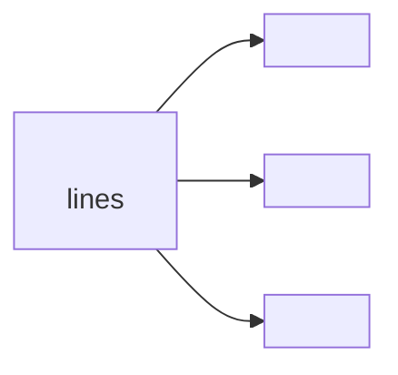

# Audit Report Template

Use this template when generating a codebase audit report. Fill in the placeholders (`<...>`) with actual findings from the scan.

The template is designed so a **new AI session** can receive this report and implement all fixes without asking clarifying questions.

---

```markdown
# Audit Report: <repo-name>

**Generated:** <date>
**Project:** <one-line description>
**Total files scanned:** <count> (excluding vendor/build/generated dirs)

---

## Executive Summary

<2-3 sentences summarizing overall health, biggest issues, and what the codebase does well.>

Example:

> The qwin codebase is a well-structured video downloader extension with clear domain boundaries. However, it suffers from severely oversized files — 26 files exceed the 400-line threshold. Naming conventions and nesting depth are clean.

---

## Severity Legend

- 🔴 **Blocker** — must fix (broken architecture, critical structural issues)
- 🟡 **Warning** — should fix (could cause maintenance problems)
- 🟢 **Suggestion** — nice to improve (best practice, low effort)

---

## Issues Found

### Phase 1: Quick Cleanup

_Low effort, safe changes. Can be done without deep code understanding._

#### Empty / Dead Directories

| Directory | Status               | Recommendation                 |
| --------- | -------------------- | ------------------------------ |
| `<path>`  | Empty                | Remove or add files as planned |
| `<path>`  | Single-child wrapper | Merge with parent              |
| `<path>`  | Accumulating logs    | Add to `.gitignore`            |

- [ ] **Remove empty/dead directories** — see table above
  > Reason: Empty directories clutter the codebase; single-child wrappers add unnecessary nesting.

---

#### Doc Sprawl

<count> `.md` files found, <count> outside organized `docs/` directory.

| Location | File                           | Status              |
| -------- | ------------------------------ | ------------------- |
| Root     | `README.md`, `CONTRIBUTING.md` | ✅ Expected at root |
| Root     | `SETUP.md`, `DEPLOYMENT.md`    | ⚠️ Move to `docs/`  |
| `<dir>`  | `<file>.md`                    | ⚠️ Misplaced        |

- [ ] **Consolidate doc files into `docs/`** — see table above
  > Reason: Doc sprawl makes finding documentation harder. A single `docs/` directory improves discoverability.

---

#### Naming Inconsistencies

| Directory | Styles Detected                    | Files Affected |
| --------- | ---------------------------------- | -------------- |
| `<dir>`   | `<style1>`, `<style2>`, `<style3>` | `<count>`      |
| `<dir>`   | `<style1>`, `<style2>`             | `<count>`      |

- [ ] **Standardize naming conventions in `<dir>`** — mixed `<styles detected>`
  > Reason: Consistent naming reduces cognitive load and makes search more predictable.

---

#### Compiled / Binary Artifacts

| File     | Size     | Issue                               |
| -------- | -------- | ----------------------------------- |
| `<path>` | `<size>` | Compiled binary checked into source |
| `<path>` | `<size>` | Backup/artifact file                |

- [ ] **Remove compiled/binaries from source tree** — see table above
  > Reason: Binaries bloat the repo, aren't diffable, and should be built during install.

> **When implementing Phase 1:** Use `skill:test-driven-development` — write tests first to verify the directory/doc/naming change doesn't break imports or references.

---

### Phase 2: File Refactoring

_Medium effort — each item may require splitting or moving code. Test before refactoring._

#### Oversized Files

<count> files exceed the <threshold>-line threshold (<percent>% of codebase).

| File     | Lines       | Problem                                                   |
| -------- | ----------- | --------------------------------------------------------- |
| `<path>` | **<count>** | Monolithic; handles <concern-1>, <concern-2>, <concern-3> |
| `<path>` | **<count>** | <brief description of why it's large>                     |
| `<path>` | **<count>** | <brief description of why it's large>                     |
| `<path>` | **<count>** | <brief description of why it's large>                     |
| `<path>` | **<count>** | <brief description of why it's large>                     |
| ...      | ...         | ...                                                       |

_Individual split plans with before/after diagrams below._

> **Language-specific splitting mechanics:** See [SPLITTING-GUIDE.md](SPLITTING-GUIDE.md) for detailed per-language before/after code examples for each major language (Python, JS/TS, Go, Rust, Java, C#, Ruby, PHP).

---

- [ ] **Split `<file-path>`** — `<line-count>` lines (threshold: ≤400)

  > **Language:** `<language>` (auto-detected from file extension)
  > **Reason:** Oversized files mix multiple concerns — harder to test, review, and maintain.
  > **Proposal:** Extract `<module1>`, `<module2>`, `<module3>` into separate files.

  **Natural Boundaries Detected:**
  | Section | Lines | Description |
  |---------|-------|-------------|
  | `<concern-1>` | `<start-end>` | `<description>` |
  | `<concern-2>` | `<start-end>` | `<description>` |
  | `<concern-3>` | `<start-end>` | `<description>` |

  **Proposed Split:**
```

<parent-dir>/
├── <original-file> (trimmed to orchestration, ~<N> lines)
├── <new-file-1> (extracted <concern-1> logic)
├── <new-file-2> (extracted <concern-2> logic)
└── <new-file-3> (extracted <concern-3> logic)

````

**Before (Mermaid):**


**After (Mermaid):**


**Import Changes:**
| Consumer File | Old Import | New Import |
|--------------|-----------|-----------|
| `<consumer-1>` | `<old-import>` | `<new-import>` |
| `<consumer-2>` | `<old-import>` | `<new-import>` |
| `<consumer-3>` | `<old-import>` | `<new-import>` |

**Language-Specific Steps (`<language>`):**

- [ ] Create new files for extracted modules
- [ ] Update barrel/entry file (`<barrel-file>`) to re-export public symbols
- [ ] Update all consumer files to use new import paths
- [ ] Remove extracted code from original file
- [ ] Run `<verification-command>` to verify imports

---

- [ ] **Split `<file-path>`** — `<line-count>` lines

  > **Language:** `<language>`
  > **Reason:** Oversized files mix multiple concerns.
  > **Proposal:** Extract `<module1>`, `<module2>` into separate files.

  **Natural Boundaries Detected:**
  | Section | Lines | Description |
  |---------|-------|-------------|
  | `<concern-1>` | `<start-end>` | `<description>` |
  | `<concern-2>` | `<start-end>` | `<description>` |

  **Proposed Split:**

  ```
  <parent-dir>/
  ├── <original-file>        (trimmed)
  ├── <new-file-1>           (extracted <concern-1>)
  └── <new-file-2>           (extracted <concern-2>)
  ```

  **Before:**

  ```mermaid
  flowchart LR
    A[<file>] --> B[<concern-1>]
    A --> C[<concern-2>]

  ```

  **After:**

  ```mermaid
  flowchart LR
    A[<file>] --> B[<module-a>]
    A --> C[<module-b>]

  ```

  **Import Changes:**
  | Consumer File | Old Import | New Import |
  |--------------|-----------|-----------|
  | `<consumer-1>` | `<old-import>` | `<new-import>` |

---

#### Misplaced Files

| File     | Current Location | Target Location | Reason                        |
| -------- | ---------------- | --------------- | ----------------------------- |
| `<file>` | Root             | `src/`          | Source files belong in `src/` |
| `<file>` | `<dir>`          | `<correct-dir>` | Doesn't match directory theme |

- [ ] **Move misplaced root files** — see table above
  > Reason: Files at root level clutter the project and violate separation of concerns.

> **When implementing Phase 2:** Use `skill:test-driven-development` — write tests for the existing behavior FIRST before splitting files. This ensures the refactored code preserves functionality. Only split files after passing tests confirm the extracted modules work correctly.

---

### Phase 3: Structural Refactoring

_Higher effort — reorganize folders, flatten nesting, improve module boundaries. Test coverage is critical._

#### Bloated Directories

<count> directories exceed the <threshold>-file limit.

| Directory | File Count  | Threshold | Recommended Split                                   |
| --------- | ----------- | --------- | --------------------------------------------------- |
| `<path>`  | **<count>** | ≤30       | Split by domain: `<sub-1>/`, `<sub-2>/`, `<sub-3>/` |
| `<path>`  | **<count>** | ≤30       | Split by type: `<sub-1>/`, `<sub-2>/`               |

**Before (ASCII tree):**

```
<dir>/
├── <file-1>
├── <file-2>
├── <file-3>
└── ... and <N> more
```

**After (ASCII tree):**

```
<dir>/
├── <subdomain-1>/
├── <subdomain-2>/
└── <subdomain-3>/
```

- [ ] **Split `<directory>`** — `<count>` files into subdirectories by domain
  > Reason: Too many files in one directory makes discovery and navigation harder.
  > Proposal: See tree diagram above.

---

#### Deeply Nested Directories

| Path     | Depth          | Threshold |
| -------- | -------------- | --------- |
| `<path>` | **<N>** levels | ≤4        |
| `<path>` | **<N>** levels | ≤4        |

- [ ] **Flatten `<deep-path>`** — `<N>` levels deep (threshold: ≤4)
  > Reason: Deep nesting increases cognitive load when navigating. Flatten by merging related modules.

---

#### Unorganized Script / Asset Directories

| Directory | File Count | Issue                                  |
| --------- | ---------- | -------------------------------------- |
| `<dir>`   | `<count>`  | Unorganized — no subdirectory grouping |
| `<dir>`   | `<count>`  | Too large (>50 MB)                     |

- [ ] **Organize `<dir>`** — `<count>` scripts without categorization
  > Reason: Unorganized scripts are hard to discover and maintain. Group by purpose: `build/`, `deploy/`, `test/`.

---

#### Architecture Issues

| File / Module | Issue         | Proposed Change                |
| ------------- | ------------- | ------------------------------ |
| `<path>`      | <description> | <specific architecture change> |
| `<path>`      | <description> | <specific architecture change> |

- [ ] **Refactor `<dir>/<file>` architecture** — see table above
  > Reason: <why current structure is problematic>
  > Proposal: <specific architecture change>

> **When implementing Phase 3:** Use `skill:test-driven-development` — before moving or restructuring any folder, write tests that verify the current public API / import paths still work. Run the full test suite after each structural change to catch regressions early.

---

## Refactoring Progress

Use this checklist to track completion. Start a new AI session with this report and tick items as they are completed.

```
Phase 1: Quick Cleanup
  [ ] Remove empty/dead directories
  [ ] Consolidate doc files into docs/
  [ ] Standardize naming conventions
  [ ] Remove compiled/binaries from source tree

Phase 2: File Refactoring
  [ ] Split oversized files
    [ ] <file-1>
    [ ] <file-2>
    [ ] <file-3>
  [ ] Move misplaced root files

Phase 3: Structural Refactoring
  [ ] Split bloated directories by domain
    [ ] <dir-1>
    [ ] <dir-2>
  [ ] Flatten deep nesting
  [ ] Organize scripts/
  [ ] Any additional architecture changes

Total: [ ] / [ ] completed
```

> **⚠️ Important:** Before implementing any refactoring that splits or moves code, always use `skill:test-driven-development`. Write tests for the existing behavior first, then refactor. This ensures:
>
> 1. You understand what the code is supposed to do
> 2. The refactored code preserves all functionality
> 3. You catch regressions immediately

> Update this checklist as you implement fixes. When all items are ticked, the codebase is clean.

---

## Edge Cases Checked

| Check                          | Status                                               |
| ------------------------------ | ---------------------------------------------------- |
| Empty repository?              | ✅ No — <count> files / ⚠️ Yes — nothing to audit    |
| Generated/vendor dirs skipped? | ✅ `<dirs excluded>`                                 |
| Binary-only repository?        | ✅ No — source code present / ⚠️ Yes — audit skipped |
| Symlinks?                      | ✅ None detected / ⚠️ <count> found                  |
| Hidden files checked?          | ✅ `<patterns included>`                             |

---

## Implementation Notes for AI

When starting implementation in a new session with this report:

1. **Always use `skill:test-driven-development`** — write a failing test first, then make it pass, then refactor. This applies especially to:
   - Splitting oversized files (you need to understand the API surface first)
   - Moving files between directories (import paths may change)
   - Restructuring modules (dependency graphs must remain valid)

2. **Implement Phase 1 first** — it's safe, low-risk, and gets quick wins.

3. **For Phase 2, tackle one file at a time** — extract modules, run tests, commit, then move to the next.

4. **For Phase 3, plan the full directory structure before moving files** — sketch the target tree, then move files in batches.

5. **After each phase, re-run the full test suite** and verify nothing is broken.

```

---

## Template Usage Notes

- Place this entire template in the report file (starting from `# Audit Report: <repo-name>`)
- Replace all `<placeholders>` with actual values from the scan
- For each issue, include **before/after diagrams** — ASCII trees for folder structure, Mermaid for file-level
- The **Phases** are ordered by increasing effort and risk — this is intentional
- The **Refactoring Progress** section should be at the bottom of the report so it's the last thing the AI reads before implementing
- Include the full "Implementation Notes for AI" section — it's essential for a new session to work without questions
```
````
