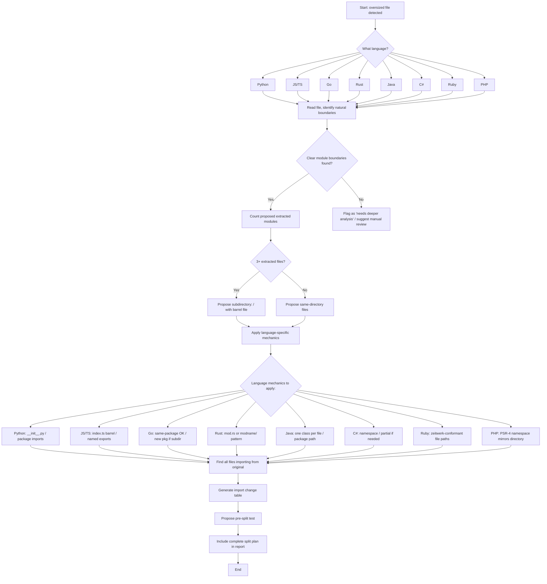

# File Splitting Guide — Language-Specific Reference

When the audit report flags a file as oversized (>400 lines), the implementing AI session must split it into smaller modules. This guide provides **language-specific mechanics** for doing so correctly.

**Load this reference when:** An audit report recommends splitting an oversized file and you need to execute the split.

---

## Universal Principles (Any Language)

These principles apply regardless of stack:

1. **Preserve the public API** — External consumers of the file should find the same exports/symbols after the split (use barrel files/re-exports when needed).
2. **One module per concern** — Extract code by natural boundaries: classes, functions, comment-section headers, import-group clusters.
3. **Prefer same-directory over subdirectory** — Keep extracted files in the same directory unless 3+ files are extracted or a clear domain boundary emerges.
4. **Match existing conventions** — Use the project's detected naming convention (snake_case, kebab-case, PascalCase) for new files.
5. **Update all references** — Every file that imported from the original must be updated. Use code-search tools to find them all.
6. **Test before and after** — Write a test capturing the public API before splitting, verify it passes after splitting.
7. **No cross-directory packages in Go** — Go requires all files in a package to be in the same directory. Splitting a Go file means keeping the same package.

---

## Decision Flowchart

Follow this decision tree for each oversized file:



### Decision Guide Table

| Step | Question                                         | Decision                                                              |
| ---- | ------------------------------------------------ | --------------------------------------------------------------------- |
| 1    | What language is the file?                       | Load this guide's relevant section                                    |
| 2    | Can you identify 2+ natural module boundaries?   | Yes → continue. No → flag as needing manual review                    |
| 3    | How many extracted modules?                      | 1-2 → same directory. 3+ → subdirectory                               |
| 4    | What naming convention does the project use?     | Detect from existing files in same directory                          |
| 5    | How many other files import from this file?      | 0-5 → straightforward. 5-20 → careful tracking. 20+ → staged approach |
| 6    | Are there circular dependencies within the file? | Yes → extract shared core first. No → proceed                         |
| 7    | Does the file have existing tests?               | Yes → use as validation. No → pre-split test required                 |

---

## Python

### Module Mechanics

- **Module unit:** Any `.py` file is a module.
- **Package:** A directory with `__init__.py` is a package (Python 3.3+ supports implicit namespace packages).
- **Import mechanism:** `import module`, `from module import name`, `from package.submodule import name`
- **Visibility:** Names prefixed with `_` are conventionally private. `__all__` in `__init__.py` controls `from package import *`.
- **Barrel file:** `__init__.py` re-exports public symbols from submodules.

### Splitting a 1000-line Service File

**Scenario:** `src/services/order_service.py` is 1000+ lines handling validation, pricing, persistence, and helpers.

**Before:**

```python
# src/services/order_service.py (1000+ lines)

import json
from decimal import Decimal
from datetime import datetime
from typing import Optional

# ─── Constants ────────────────────────────────────────
MIN_ORDER_AMOUNT = Decimal("10.00")
MAX_DISCOUNT_PERCENT = Decimal("50.00")

# ─── Validation ───────────────────────────────────────
def validate_order(order: dict) -> list[str]:
    errors = []
    if order.get("amount", 0) < MIN_ORDER_AMOUNT:
        errors.append("Order amount below minimum")
    if not order.get("items"):
        errors.append("Order has no items")
    return errors

# ─── Pricing ──────────────────────────────────────────
def calculate_subtotal(items: list[dict]) -> Decimal:
    return sum(Decimal(item["price"]) * item["qty"] for item in items)

def apply_discount(subtotal: Decimal, discount_pct: Decimal) -> Decimal:
    if discount_pct > MAX_DISCOUNT_PERCENT:
        discount_pct = MAX_DISCOUNT_PERCENT
    return subtotal * (Decimal("100") - discount_pct) / Decimal("100")

def calculate_tax(amount: Decimal, rate: Decimal) -> Decimal:
    return amount * rate

# ─── Persistence ──────────────────────────────────────
def save_order(order: dict) -> int:
    # ... database write logic ...
    return 12345

def get_order_by_id(order_id: int) -> Optional[dict]:
    # ... database read logic ...
    return None

# ─── Helpers ──────────────────────────────────────────
def format_currency(amount: Decimal) -> str:
    return f"${amount:.2f}"

def log_order_action(action: str, order_id: int) -> None:
    print(f"[{datetime.now()}] Order {order_id}: {action}")
```

**After (same directory, flat — 4 extracted files + updated **init**.py):**

`src/services/order_validation.py`:

```python
from decimal import Decimal

MIN_ORDER_AMOUNT = Decimal("10.00")

def validate_order(order: dict) -> list[str]:
    errors = []
    if order.get("amount", 0) < MIN_ORDER_AMOUNT:
        errors.append("Order amount below minimum")
    if not order.get("items"):
        errors.append("Order has no items")
    return errors
```

`src/services/order_pricing.py`:

```python
from decimal import Decimal

MAX_DISCOUNT_PERCENT = Decimal("50.00")

def calculate_subtotal(items: list[dict]) -> Decimal:
    return sum(Decimal(item["price"]) * item["qty"] for item in items)

def apply_discount(subtotal: Decimal, discount_pct: Decimal) -> Decimal:
    if discount_pct > MAX_DISCOUNT_PERCENT:
        discount_pct = MAX_DISCOUNT_PERCENT
    return subtotal * (Decimal("100") - discount_pct) / Decimal("100")

def calculate_tax(amount: Decimal, rate: Decimal) -> Decimal:
    return amount * rate
```

`src/services/order_repository.py`:

```python
from typing import Optional

def save_order(order: dict) -> int:
    # ... database write logic ...
    return 12345

def get_order_by_id(order_id: int) -> Optional[dict]:
    # ... database read logic ...
    return None
```

`src/services/order_helpers.py`:

```python
from decimal import Decimal
from datetime import datetime

def format_currency(amount: Decimal) -> str:
    return f"${amount:.2f}"

def log_order_action(action: str, order_id: int) -> None:
    print(f"[{datetime.now()}] Order {order_id}: {action}")
```

`src/services/order_service.py` (trimmed to orchestration):

```python
"""Order service — orchestration layer."""
from decimal import Decimal
from order_validation import validate_order
from order_pricing import calculate_subtotal, apply_discount, calculate_tax
from order_repository import save_order, get_order_by_id
from order_helpers import format_currency, log_order_action

MIN_ORDER_AMOUNT = Decimal("10.00")  # Exported constant

__all__ = [
    "validate_order",
    "calculate_subtotal",
    "apply_discount",
    "calculate_tax",
    "save_order",
    "get_order_by_id",
    "format_currency",
    "log_order_action",
    "MIN_ORDER_AMOUNT",
]
```

`src/services/__init__.py` (if it exists, update it):

```python
from .order_service import *
```

### Subdirectory Approach (3+ extracted files)

If you prefer a subdirectory:

```
Before:                          After:
src/services/                    src/services/
└── order_service.py              ├── order/
                                   │   ├── __init__.py     (re-exports)
                                   │   ├── validation.py
                                   │   ├── pricing.py
                                   │   ├── repository.py
                                   │   └── helpers.py
                                   └── order_service.py   (removed)
```

`src/services/order/__init__.py`:

```python
from .validation import validate_order
from .pricing import calculate_subtotal, apply_discount, calculate_tax
from .repository import save_order, get_order_by_id
from .helpers import format_currency, log_order_action

__all__ = [
    "validate_order",
    "calculate_subtotal",
    "apply_discount",
    "calculate_tax",
    "save_order",
    "get_order_by_id",
    "format_currency",
    "log_order_action",
]
```

### Import Update Checklist

- [ ] Create new `.py` files for extracted modules
- [ ] Update or create `__init__.py` to re-export public symbols
- [ ] Update all `from order_service import X` → `from order_validation import X` etc.
- [ ] Remove extracted code from `order_service.py`
- [ ] Run `python -c "from order_service import *"` or `pytest` to verify

---

## JavaScript / TypeScript

### Module Mechanics

- **Module unit:** Any `.js` / `.ts` / `.tsx` / `.jsx` file with `export`/`import` is an ES Module.
- **Barrel file:** `index.ts` (or `index.js`) re-exports from sibling modules.
- **Import mechanism:** `import { X } from './module'`, `import X from './module'` (default), `export { X }`, `export default X`
- **Visibility:** Only `export`ed symbols are visible outside the module. Everything else is private.
- **Circular deps:** Common in JS/TS. Check for cycles when splitting.

### Splitting a 1000-line React Component

**Scenario:** `src/features/orders/OrderDashboard.tsx` is 1000+ lines with sections, business logic, and UI.

**Before:**

```tsx
// src/features/orders/OrderDashboard.tsx (1000+ lines)

import React, { useState, useEffect, useCallback } from "react";
import { api } from "../../api";
import { formatCurrency } from "../../utils";

// ─── Types ────────────────────────────────────────────
interface Order {
  id: number;
  customer: string;
  amount: number;
  status: "pending" | "shipped" | "cancelled";
  items: OrderItem[];
}

interface OrderItem {
  sku: string;
  qty: number;
  price: number;
}

// ─── Data Fetching Hook ──────────────────────────────
function useOrders(filters?: Record<string, string>) {
  const [orders, setOrders] = useState<Order[]>([]);
  const [loading, setLoading] = useState(false);
  const [error, setError] = useState<string | null>(null);

  const fetchOrders = useCallback(async () => {
    setLoading(true);
    try {
      const data = await api.getOrders(filters);
      setOrders(data);
    } catch (err) {
      setError(err.message);
    } finally {
      setLoading(false);
    }
  }, [filters]);

  useEffect(() => {
    fetchOrders();
  }, [fetchOrders]);

  return { orders, loading, error, refetch: fetchOrders };
}

// ─── Order Status Badge ──────────────────────────────
function OrderStatusBadge({ status }: { status: Order["status"] }) {
  const colors: Record<string, string> = {
    pending: "bg-yellow-100 text-yellow-800",
    shipped: "bg-green-100 text-green-800",
    cancelled: "bg-red-100 text-red-800",
  };
  return (
    <span className={`px-2 py-1 rounded ${colors[status]}`}>{status}</span>
  );
}

// ─── Order Row ────────────────────────────────────────
function OrderRow({ order }: { order: Order }) {
  return (
    <tr className="border-b hover:bg-gray-50">
      <td className="p-2">{order.id}</td>
      <td className="p-2">{order.customer}</td>
      <td className="p-2">{formatCurrency(order.amount)}</td>
      <td className="p-2">
        <OrderStatusBadge status={order.status} />
      </td>
    </tr>
  );
}

// ─── Main Component ──────────────────────────────────
export default function OrderDashboard() {
  const { orders, loading, error, refetch } = useOrders();

  if (error) return <div className="text-red-500">Error: {error}</div>;
  if (loading) return <div>Loading...</div>;

  return (
    <div className="p-6">
      <div className="flex justify-between items-center mb-4">
        <h1 className="text-2xl font-bold">Orders</h1>
        <button onClick={refetch} className="btn-primary">
          Refresh
        </button>
      </div>
      <table className="w-full">
        <thead>
          <tr>
            <th className="text-left p-2">ID</th>
            <th className="text-left p-2">Customer</th>
            <th className="text-left p-2">Amount</th>
            <th className="text-left p-2">Status</th>
          </tr>
        </thead>
        <tbody>
          {orders.map((order) => (
            <OrderRow key={order.id} order={order} />
          ))}
        </tbody>
      </table>
    </div>
  );
}
```

**After (subdirectory approach):**

```
src/features/orders/
├── index.ts                   (barrel — re-exports public API)
├── types.ts                   (Order, OrderItem interfaces)
├── useOrders.ts               (data fetching hook)
├── OrderStatusBadge.tsx        (status badge component)
├── OrderRow.tsx                (table row component)
└── OrderDashboard.tsx          (main component, trimmed)
```

`src/features/orders/types.ts`:

```ts
export interface Order {
  id: number;
  customer: string;
  amount: number;
  status: "pending" | "shipped" | "cancelled";
  items: OrderItem[];
}

export interface OrderItem {
  sku: string;
  qty: number;
  price: number;
}
```

`src/features/orders/useOrders.ts`:

```ts
import { useState, useEffect, useCallback } from "react";
import { api } from "../../api";
import type { Order } from "./types";

export function useOrders(filters?: Record<string, string>) {
  const [orders, setOrders] = useState<Order[]>([]);
  const [loading, setLoading] = useState(false);
  const [error, setError] = useState<string | null>(null);

  const fetchOrders = useCallback(async () => {
    setLoading(true);
    try {
      const data = await api.getOrders(filters);
      setOrders(data);
    } catch (err) {
      setError((err as Error).message);
    } finally {
      setLoading(false);
    }
  }, [filters]);

  useEffect(() => {
    fetchOrders();
  }, [fetchOrders]);

  return { orders, loading, error, refetch: fetchOrders };
}
```

`src/features/orders/OrderStatusBadge.tsx`:

```tsx
import type { Order } from "./types";

const STATUS_COLORS: Record<string, string> = {
  pending: "bg-yellow-100 text-yellow-800",
  shipped: "bg-green-100 text-green-800",
  cancelled: "bg-red-100 text-red-800",
};

export function OrderStatusBadge({ status }: { status: Order["status"] }) {
  return (
    <span className={`px-2 py-1 rounded ${STATUS_COLORS[status]}`}>
      {status}
    </span>
  );
}
```

`src/features/orders/OrderRow.tsx`:

```tsx
import { formatCurrency } from "../../utils";
import { OrderStatusBadge } from "./OrderStatusBadge";
import type { Order } from "./types";

export function OrderRow({ order }: { order: Order }) {
  return (
    <tr className="border-b hover:bg-gray-50 transition-colors">
      <td className="p-2">{order.id}</td>
      <td className="p-2">{order.customer}</td>
      <td className="p-2">{formatCurrency(order.amount)}</td>
      <td className="p-2">
        <OrderStatusBadge status={order.status} />
      </td>
    </tr>
  );
}
```

`src/features/orders/OrderDashboard.tsx` (trimmed):

```tsx
import { useOrders } from "./useOrders";
import { OrderRow } from "./OrderRow";

export default function OrderDashboard() {
  const { orders, loading, error, refetch } = useOrders();

  if (error) return <div className="text-red-500">Error: {error}</div>;
  if (loading) return <div className="animate-pulse">Loading...</div>;

  return (
    <div className="p-6">
      <div className="flex justify-between items-center mb-4">
        <h1 className="text-2xl font-bold">Orders</h1>
        <button onClick={refetch} className="btn-primary">
          Refresh
        </button>
      </div>
      <table className="w-full">
        <thead>
          <tr>
            <th className="text-left p-2">ID</th>
            <th className="text-left p-2">Customer</th>
            <th className="text-left p-2">Amount</th>
            <th className="text-left p-2">Status</th>
          </tr>
        </thead>
        <tbody>
          {orders.map((order) => (
            <OrderRow key={order.id} order={order} />
          ))}
        </tbody>
      </table>
    </div>
  );
}
```

`src/features/orders/index.ts`:

```ts
export { useOrders } from "./useOrders";
export { OrderStatusBadge } from "./OrderStatusBadge";
export { OrderRow } from "./OrderRow";
export { default as OrderDashboard } from "./OrderDashboard";
export type { Order, OrderItem } from "./types";
```

### Import Update Checklist

- [ ] Create new `.ts`/`.tsx` files for extracted modules
- [ ] Create `index.ts` barrel to re-export all public symbols
- [ ] Update consumers: `import { X } from './OrderDashboard'` → `import { X } from './orders'`
- [ ] Check for circular dependencies (A imports B imports A)
- [ ] Run `tsc --noEmit` and `npm test`

---

## Go

### Package Mechanics

- **Critical rule:** All `.go` files in the **same directory** belong to the **same package**. You cannot split a package across directories.
- **File naming:** Snake_case for filenames (`order_service.go`).
- **Visibility:** Capitalized identifiers = exported (public). Lowercase = package-private.
- **Same-package imports:** Not needed. Functions/variables in one file are visible to all files in the same package.
- **Cross-package imports:** Use the module path from `go.mod`, e.g., `import "myapp/internal/order"`.

### Splitting a 1000-line Package File

**Scenario:** `internal/order/service.go` is 1000+ lines. All extracted files stay in the same `order` package.

**Before:**

```go
// internal/order/service.go (1000+ lines)

package order

import (
	"context"
	"database/sql"
	"errors"
	"fmt"
	"time"
)

// ─── Types ────────────────────────────────────────────
type Order struct {
	ID        int64
	Customer  string
	Amount    float64
	Status    string
	CreatedAt time.Time
}

type OrderFilter struct {
	Status string
	Page   int
	Limit  int
}

// ─── Validation ───────────────────────────────────────
func ValidateOrder(o *Order) error {
	if o.Amount <= 0 {
		return errors.New("amount must be positive")
	}
	if o.Customer == "" {
		return errors.New("customer is required")
	}
	return nil
}

// ─── Repository ───────────────────────────────────────
type Repository struct {
	db *sql.DB
}

func (r *Repository) Save(ctx context.Context, o *Order) (int64, error) {
	// ... database insert ...
	return 1, nil
}

func (r *Repository) FindByID(ctx context.Context, id int64) (*Order, error) {
	// ... database query ...
	return nil, nil
}

func (r *Repository) List(ctx context.Context, filter OrderFilter) ([]*Order, error) {
	// ... database query ...
	return nil, nil
}

// ─── Service ──────────────────────────────────────────
type Service struct {
	repo *Repository
}

func NewService(repo *Repository) *Service {
	return &Service{repo: repo}
}

func (s *Service) PlaceOrder(ctx context.Context, o *Order) (*Order, error) {
	if err := ValidateOrder(o); err != nil {
		return nil, fmt.Errorf("validation failed: %w", err)
	}
	o.Status = "pending"
	o.CreatedAt = time.Now()
	id, err := s.repo.Save(ctx, o)
	if err != nil {
		return nil, err
	}
	o.ID = id
	return o, nil
}
```

**After (split into 3 files in the same package — no import changes needed within package):**

`internal/order/types.go`:

```go
package order

import "time"

type Order struct {
	ID        int64
	Customer  string
	Amount    float64
	Status    string
	CreatedAt time.Time
}

type OrderFilter struct {
	Status string
	Page   int
	Limit  int
}
```

`internal/order/repository.go`:

```go
package order

import (
	"context"
	"database/sql"
)

type Repository struct {
	db *sql.DB
}

func (r *Repository) Save(ctx context.Context, o *Order) (int64, error) {
	// ... database insert ...
	return 1, nil
}

func (r *Repository) FindByID(ctx context.Context, id int64) (*Order, error) {
	// ... database query ...
	return nil, nil
}

func (r *Repository) List(ctx context.Context, filter OrderFilter) ([]*Order, error) {
	// ... database query ...
	return nil, nil
}
```

`internal/order/service.go` (trimmed):

```go
package order

import (
	"context"
	"errors"
	"fmt"
	"time"
)

func ValidateOrder(o *Order) error {
	if o.Amount <= 0 {
		return errors.New("amount must be positive")
	}
	if o.Customer == "" {
		return errors.New("customer is required")
	}
	return nil
}

type Service struct {
	repo *Repository
}

func NewService(repo *Repository) *Service {
	return &Service{repo: repo}
}

func (s *Service) PlaceOrder(ctx context.Context, o *Order) (*Order, error) {
	if err := ValidateOrder(o); err != nil {
		return nil, fmt.Errorf("validation failed: %w", err)
	}
	o.Status = "pending"
	o.CreatedAt = time.Now()
	id, err := s.repo.Save(ctx, o)
	if err != nil {
		return nil, err
	}
	o.ID = id
	return o, nil
}
```

### When to Create a New Package (Subdirectory)

If the extracted code should be **reusable across other packages**, move it to a new subdirectory with a different package name:

```
internal/order/
├── service.go
├── repository.go
└── types.go

# → becomes:

internal/
├── order/
│   ├── service.go
│   └── types.go
└── orderdb/
    └── repository.go    ← new package `orderdb`
```

Then consumers import: `import "myapp/internal/orderdb"`

> **Important:** If you move `repository.go` to a new `orderdb` package, `service.go` (which references `Repository`) must be updated to import the new package path and use `orderdb.Repository` instead of just `Repository`. This changes a same-package reference to a cross-package import.

### Import Update Checklist

- [ ] Create new `.go` files in the same package directory (no import changes needed)
- [ ] If creating a new package (subdirectory): add `package <name>` declaration
- [ ] Update cross-package imports: change `import "myapp/internal/order"` → `import "myapp/internal/orderdb"` if needed
- [ ] Run `go build ./...` and `go test ./...`

---

## Rust

### Module Mechanics

- **Module unit:** A file or directory with `mod.rs` (or `module_name.rs` + `module_name/` directory).
- **Module declaration:** Use `mod module_name;` in the parent file to declare a child module.
- **Visibility:** `pub` = public, `pub(crate)` = visible within crate, `pub(super)` = visible within parent module. Default = private.
- **Import pattern:** `use crate::module::submodule::Item;`
- **Test modules:** `#[cfg(test)] mod tests { ... }` can stay in the same file or be extracted.

### Splitting a 1000-line Module

**Scenario:** `src/order/mod.rs` is 1000+ lines handling types, service logic, and database access.

**Before:**

```rust
// src/order/mod.rs (1000+ lines)

use std::collections::HashMap;
use chrono::{DateTime, Utc};
use sqlx::PgPool;

// ─── Types ────────────────────────────────────────────
#[derive(Debug, Clone)]
pub struct Order {
    pub id: i64,
    pub customer: String,
    pub amount: f64,
    pub status: OrderStatus,
    pub created_at: DateTime<Utc>,
}

#[derive(Debug, Clone)]
pub enum OrderStatus {
    Pending,
    Shipped,
    Cancelled,
}

// ─── Repository ───────────────────────────────────────
pub struct Repository {
    pool: PgPool,
}

impl Repository {
    pub fn new(pool: PgPool) -> Self {
        Self { pool }
    }

    pub async fn save(&self, order: &Order) -> Result<i64, sqlx::Error> {
        // ... database insert ...
        Ok(1)
    }

    pub async fn find_by_id(&self, id: i64) -> Result<Option<Order>, sqlx::Error> {
        // ... database query ...
        Ok(None)
    }
}

// ─── Service ──────────────────────────────────────────
pub struct Service {
    repo: Repository,
}

impl Service {
    pub fn new(repo: Repository) -> Self {
        Self { repo }
    }

    pub async fn place_order(&self, mut order: Order) -> Result<Order, String> {
        if order.amount <= 0.0 {
            return Err("Amount must be positive".to_string());
        }
        if order.customer.is_empty() {
            return Err("Customer is required".to_string());
        }
        order.status = OrderStatus::Pending;
        order.created_at = Utc::now();
        let id = self.repo.save(&order).await.map_err(|e| e.to_string())?;
        order.id = id;
        Ok(order)
    }
}
```

**After (split into module files):**

`src/order/mod.rs` — declare submodules and re-export:

```rust
pub mod types;
pub mod repository;
pub mod service;

pub use types::{Order, OrderStatus};
pub use repository::Repository;
pub use service::Service;
```

`src/order/types.rs`:

```rust
use chrono::{DateTime, Utc};

#[derive(Debug, Clone)]
pub struct Order {
    pub id: i64,
    pub customer: String,
    pub amount: f64,
    pub status: OrderStatus,
    pub created_at: DateTime<Utc>,
}

#[derive(Debug, Clone)]
pub enum OrderStatus {
    Pending,
    Shipped,
    Cancelled,
}
```

`src/order/repository.rs`:

```rust
use sqlx::PgPool;
use crate::order::types::Order;

pub struct Repository {
    pool: PgPool,
}

impl Repository {
    pub fn new(pool: PgPool) -> Self {
        Self { pool }
    }

    pub async fn save(&self, order: &Order) -> Result<i64, sqlx::Error> {
        // ... database insert ...
        Ok(1)
    }

    pub async fn find_by_id(&self, id: i64) -> Result<Option<Order>, sqlx::Error> {
        // ... database query ...
        Ok(None)
    }
}
```

`src/order/service.rs`:

```rust
use chrono::Utc;
use crate::order::types::{Order, OrderStatus};
use crate::order::repository::Repository;

pub struct Service {
    repo: Repository,
}

impl Service {
    pub fn new(repo: Repository) -> Self {
        Self { repo }
    }

    pub async fn place_order(&self, mut order: Order) -> Result<Order, String> {
        if order.amount <= 0.0 {
            return Err("Amount must be positive".to_string());
        }
        if order.customer.is_empty() {
            return Err("Customer is required".to_string());
        }
        order.status = OrderStatus::Pending;
        order.created_at = Utc::now();
        let id = self.repo.save(&order).await.map_err(|e| e.to_string())?;
        order.id = id;
        Ok(order)
    }
}
```

### Module Directory Pattern

Two valid approaches:

**Option A — Single file:**

```
src/order.rs — contains everything
```

**Option B — Directory with files:**

```
src/order/
├── mod.rs      — declares submodules, re-exports
├── types.rs
├── service.rs
└── repository.rs
```

The parent file declares: `mod order;` — Rust automatically finds `src/order/mod.rs`.

### Import Update Checklist

- [ ] Create submodule files with `pub mod` declarations in `mod.rs`
- [ ] Update `use` paths: change `use crate::order::Type` → `use crate::order::types::Type` if needed
- [ ] Add `pub use` re-exports in `mod.rs` to preserve the public API
- [ ] Run `cargo check` and `cargo test`

---

## Java

### Class Mechanics

- **One public top-level class per file.** The filename must match the class name (`UserService.java` contains `public class UserService`).
- **Package:** Directory structure mirrors the package hierarchy (`com/company/project/`).
- **Import:** `import com.company.project.user.UserService;`
- **Visibility:** `public` (visible everywhere), `protected` (package + subclasses), package-private (no modifier), `private` (class only).
- **Splitting large classes:** Extract logic into helper classes in the same package, or use composition.

### Splitting a 1000-line Service Class

**Scenario:** `UserService.java` in `src/main/java/com/company/user/` is 1000+ lines handling validation, business logic, and data access.

**Before:**

```java
// src/main/java/com/company/user/UserService.java (1000+ lines)

package com.company.user;

import com.company.user.User;
import com.company.db.Database;
import java.util.List;
import java.util.Optional;

public class UserService {
    private final Database db;

    public UserService(Database db) {
        this.db = db;
    }

    // ─── Validation ────────────────────────────────
    public void validateUser(User user) {
        if (user.getEmail() == null || !user.getEmail().contains("@")) {
            throw new IllegalArgumentException("Invalid email");
        }
        if (user.getAge() < 18) {
            throw new IllegalArgumentException("Must be 18+");
        }
    }

    // ─── Business Logic ────────────────────────────
    public void registerUser(User user) {
        validateUser(user);
        user.setStatus("active");
        db.save(user);
    }

    public User updateProfile(Long userId, User updates) {
        User existing = db.findById(userId)
            .orElseThrow(() -> new RuntimeException("User not found"));
        if (updates.getEmail() != null) existing.setEmail(updates.getEmail());
        if (updates.getName() != null) existing.setName(updates.getName());
        db.save(existing);
        return existing;
    }

    // ─── Data Access ───────────────────────────────
    public Optional<User> findById(Long id) {
        return db.findById(id);
    }

    public List<User> searchByName(String name) {
        return db.findByName(name);
    }

    public void deleteUser(Long id) {
        db.delete(id);
    }
}
```

**After (extract into helper classes in the same package):**

`UserValidation.java`:

```java
package com.company.user;

import com.company.user.User;

public class UserValidation {
    public static void validateUser(User user) {
        if (user.getEmail() == null || !user.getEmail().contains("@")) {
            throw new IllegalArgumentException("Invalid email");
        }
        if (user.getAge() < 18) {
            throw new IllegalArgumentException("Must be 18+");
        }
    }
}
```

`UserRepository.java`:

```java
package com.company.user;

import com.company.user.User;
import com.company.db.Database;
import java.util.List;
import java.util.Optional;

public class UserRepository {
    private final Database db;

    public UserRepository(Database db) {
        this.db = db;
    }

    public Optional<User> findById(Long id) {
        return db.findById(id);
    }

    public List<User> searchByName(String name) {
        return db.findByName(name);
    }

    public void deleteUser(Long id) {
        db.delete(id);
    }

    public void save(User user) {
        db.save(user);
    }
}
```

`UserService.java` (trimmed):

```java
package com.company.user;

import com.company.db.Database;

public class UserService {
    private final UserRepository repository;

    public UserService(Database db) {
        this.repository = new UserRepository(db);
    }

    public void registerUser(User user) {
        UserValidation.validateUser(user);
        user.setStatus("active");
        // Pass to repository
        User userCopy = user; // simplified
    }

    public User updateProfile(Long userId, User updates) {
        User existing = repository.findById(userId)
            .orElseThrow(() -> new RuntimeException("User not found"));
        if (updates.getEmail() != null) existing.setEmail(updates.getEmail());
        if (updates.getName() != null) existing.setName(updates.getName());
        repository.save(existing);
        return existing;
    }

    // Delegate data access methods
    public java.util.Optional<User> findById(Long id) {
        return repository.findById(id);
    }
}
```

### Import Update Checklist

- [ ] Create new `.java` files with correct package declaration
- [ ] Update imports in consumer files if package changes
- [ ] Use `static` imports for utility methods if appropriate
- [ ] Run `mvn compile` or `gradle build`

---

## C#

### Namespace & Class Mechanics

- **File naming:** PascalCase (`UserService.cs`).
- **Namespace:** Logical grouping that typically mirrors folder structure (`Company.Project.Users`).
- **Partial classes:** C# allows splitting a single class across multiple files with the `partial` keyword.
- **Import:** `using Company.Project.Users;`
- **Visibility:** `public`, `internal` (assembly-wide), `protected`, `private`.
- **Project separation:** For very large solutions, extract into separate `.csproj` projects.

### Splitting a 1000-line Service Class

**Scenario:** `Services/UserService.cs` is 1000+ lines. You can split using `partial` classes or extract new classes.

**Option A — Partial classes** (when the class is inherently a single unit but too large):

`UserService.Core.cs` (partial — main logic):

```csharp
namespace MyApp.Services;

public partial class UserService
{
    private readonly Database _db;

    public UserService(Database db)
    {
        _db = db;
    }

    public User RegisterUser(User user)
    {
        ValidateUser(user);
        user.Status = "active";
        _db.Save(user);
        return user;
    }
}
```

`UserService.Validation.cs` (partial — validation logic):

```csharp
namespace MyApp.Services;

public partial class UserService
{
    private void ValidateUser(User user)
    {
        if (string.IsNullOrEmpty(user.Email) || !user.Email.Contains('@'))
            throw new ArgumentException("Invalid email");

        if (user.Age < 18)
            throw new ArgumentException("Must be 18+");
    }
}
```

`UserService.DataAccess.cs` (partial — database operations):

```csharp
namespace MyApp.Services;

public partial class UserService
{
    public User? FindById(long id) => _db.FindById(id);
    public IEnumerable<User> SearchByName(string name) => _db.FindByName(name);
    public void DeleteUser(long id) => _db.Delete(id);
}
```

**Option B — Extract new classes** (preferred for clear separation of concerns):

`Services/UserValidation.cs`:

```csharp
namespace MyApp.Services;

public static class UserValidation
{
    public static void Validate(User user)
    {
        if (string.IsNullOrEmpty(user.Email) || !user.Email.Contains('@'))
            throw new ArgumentException("Invalid email");
        if (user.Age < 18)
            throw new ArgumentException("Must be 18+");
    }
}
```

`Services/UserRepository.cs`:

```csharp
namespace MyApp.Services;

public class UserRepository
{
    private readonly Database _db;
    public UserRepository(Database db) => _db = db;
    public User? FindById(long id) => _db.FindById(id);
    public IEnumerable<User> SearchByName(string name) => _db.FindByName(name);
    public void Save(User user) => _db.Save(user);
    public void Delete(long id) => _db.Delete(id);
}
```

### Import Update Checklist

- [ ] Create new `.cs` files with the correct namespace
- [ ] If using `partial`, ensure all partial files declare `partial class`
- [ ] Add `using` statements where needed
- [ ] Run `dotnet build` and `dotnet test`

---

## Ruby (Rails)

### Autoloading Mechanics

- **Zeitwerk autoloading** (Rails 6+): File path must match the constant name. `app/models/user.rb` defines `User`. `app/services/order_processor.rb` defines `OrderProcessor`.
- **Snake_case for files:** `order_service.rb`.
- **No explicit `require` needed:** Rails autoloads based on naming conventions.
- **Concerns:** `app/models/concerns/` for shared model behavior. `app/controllers/concerns/` for shared controller behavior.

### Splitting a 1000-line Rails Model

**Scenario:** `app/models/order.rb` is 1000+ lines with validations, state machine, pricing logic, and scopes.

**Before:**

```ruby
# app/models/order.rb (1000+ lines)

class Order < ApplicationRecord
  # ─── Constants ─────────────────────────────────────
  MIN_AMOUNT = 10.00
  MAX_DISCOUNT = 50.00

  # ─── Associations ──────────────────────────────────
  belongs_to :user
  has_many :line_items, dependent: :destroy

  # ─── Validations ───────────────────────────────────
  validates :amount, numericality: { greater_than_or_equal_to: MIN_AMOUNT }
  validates :status, inclusion: { in: %w[pending shipped cancelled] }

  # ─── Scopes ────────────────────────────────────────
  scope :recent, -> { where('created_at > ?', 7.days.ago) }
  scope :by_status, ->(status) { where(status: status) }

  # ─── Pricing Logic ─────────────────────────────────
  def subtotal
    line_items.sum { |li| li.price * li.quantity }
  end

  def apply_discount(percent)
    self.discount = [percent, MAX_DISCOUNT].min
    save!
  end

  # ─── State Management ──────────────────────────────
  def ship!
    update!(status: 'shipped', shipped_at: Time.current)
  end

  def cancel!
    update!(status: 'cancelled')
  end
end
```

**After (extract into concerns and service objects):**

`app/models/concerns/order_pricing.rb`:

```ruby
module OrderPricing
  extend ActiveSupport::Concern

  MAX_DISCOUNT = 50.00

  def subtotal
    line_items.sum { |li| li.price * li.quantity }
  end

  def apply_discount(percent)
    self.discount = [percent, MAX_DISCOUNT].min
    save!
  end
end
```

`app/services/order_state_machine.rb`:

```ruby
class OrderStateMachine
  attr_reader :order

  def initialize(order)
    @order = order
  end

  def ship!
    order.update!(status: 'shipped', shipped_at: Time.current)
  end

  def cancel!
    order.update!(status: 'cancelled')
  end
end
```

`app/models/order.rb` (trimmed):

```ruby
class Order < ApplicationRecord
  include OrderPricing

  MIN_AMOUNT = 10.00

  belongs_to :user
  has_many :line_items, dependent: :destroy

  validates :amount, numericality: { greater_than_or_equal_to: MIN_AMOUNT }
  validates :status, inclusion: { in: %w[pending shipped cancelled] }

  scope :recent, -> { where('created_at > ?', 7.days.ago) }
  scope :by_status, ->(status) { where(status: status) }

  def state_machine
    @state_machine ||= OrderStateMachine.new(self)
  end
end
```

### Import Update Checklist

- [ ] Create new `.rb` files in the correct directory (Rails autoloads by path)
- [ ] Ensure file path matches class/module name for Zeitwerk
- [ ] Add `include ModuleName` or delegate to new service objects
- [ ] Run `rails test` or `rspec`

---

## PHP (Laravel)

### PSR-4 Autoloading Mechanics

- **PSR-4:** Namespace maps directly to directory structure. `App\Services\OrderService` → `app/Services/OrderService.php`.
- **One class per file:** Required by PSR-4.
- **File naming:** PascalCase matches class name (`OrderService.php`).
- **Import:** `use App\Services\OrderService;`
- **Composer:** Run `composer dump-autoload` after moving/renaming files to regenerate the autoload map.

### Splitting a 1000-line Controller

**Scenario:** `app/Http/Controllers/OrderController.php` is 1000+ lines with request handling, validation, business logic, and database queries.

**Before:**

```php
<?php

namespace App\Http\Controllers;

use App\Models\Order;
use Illuminate\Http\Request;

class OrderController extends Controller
{
    // ─── Validation ─────────────────────────────────
    private function validateOrder(Request $request): array
    {
        return $request->validate([
            'customer_id' => 'required|exists:customers,id',
            'items' => 'required|array|min:1',
            'items.*.sku' => 'required|string',
            'items.*.qty' => 'required|integer|min:1',
            'items.*.price' => 'required|numeric|min:0',
        ]);
    }

    // ─── Actions ────────────────────────────────────
    public function store(Request $request)
    {
        $data = $this->validateOrder($request);
        $order = Order::create([
            'customer_id' => $data['customer_id'],
            'status' => 'pending',
            'total' => 0,
        ]);
        // ... create line items, calculate total ...
        return response()->json($order, 201);
    }

    public function ship(int $id)
    {
        $order = Order::findOrFail($id);
        $order->update(['status' => 'shipped', 'shipped_at' => now()]);
        return response()->json($order);
    }

    public function cancel(int $id)
    {
        $order = Order::findOrFail($id);
        $order->update(['status' => 'cancelled']);
        return response()->json($order);
    }

    // ─── Queries ────────────────────────────────────
    public function index(Request $request)
    {
        $orders = Order::with('items')
            ->when($request->status, fn($q, $v) => $q->where('status', $v))
            ->when($request->customer, fn($q, $v) => $q->where('customer_id', $v))
            ->paginate($request->per_page ?? 15);
        return response()->json($orders);
    }
}
```

**After (extract into service class + form request):**

`app/Http/Requests/StoreOrderRequest.php`:

```php
<?php

namespace App\Http\Requests;

use Illuminate\Foundation\Http\FormRequest;

class StoreOrderRequest extends FormRequest
{
    public function authorize(): bool
    {
        return true;
    }

    public function rules(): array
    {
        return [
            'customer_id' => 'required|exists:customers,id',
            'items' => 'required|array|min:1',
            'items.*.sku' => 'required|string',
            'items.*.qty' => 'required|integer|min:1',
            'items.*.price' => 'required|numeric|min:0',
        ];
    }
}
```

`app/Services/OrderService.php`:

```php
<?php

namespace App\Services;

use App\Models\Order;
use App\Http\Requests\StoreOrderRequest;

class OrderService
{
    public function createOrder(StoreOrderRequest $request): Order
    {
        $data = $request->validated();
        $order = Order::create([
            'customer_id' => $data['customer_id'],
            'status' => 'pending',
            'total' => 0,
        ]);
        // ... create line items, calculate total ...
        return $order;
    }

    public function ship(int $id): Order
    {
        $order = Order::findOrFail($id);
        $order->update(['status' => 'shipped', 'shipped_at' => now()]);
        return $order;
    }

    public function cancel(int $id): Order
    {
        $order = Order::findOrFail($id);
        $order->update(['status' => 'cancelled']);
        return $order;
    }
}
```

`app/Http/Controllers/OrderController.php` (trimmed):

```php
<?php

namespace App\Http\Controllers;

use App\Services\OrderService;
use App\Http\Requests\StoreOrderRequest;
use App\Models\Order;
use Illuminate\Http\Request;

class OrderController extends Controller
{
    public function __construct(
        private OrderService $orderService
    ) {}

    public function store(StoreOrderRequest $request)
    {
        $order = $this->orderService->createOrder($request);
        return response()->json($order, 201);
    }

    public function ship(int $id)
    {
        $order = $this->orderService->ship($id);
        return response()->json($order);
    }

    public function cancel(int $id)
    {
        $order = $this->orderService->cancel($id);
        return response()->json($order);
    }

    public function index(Request $request)
    {
        $orders = Order::with('items')
            ->when($request->status, fn($q, $v) => $q->where('status', $v))
            ->when($request->customer, fn($q, $v) => $q->where('customer_id', $v))
            ->paginate($request->per_page ?? 15);
        return response()->json($orders);
    }
}
```

### Import Update Checklist

- [ ] Create new PHP files with correct namespace declarations
- [ ] Add `use` statements in consumer files
- [ ] Run `composer dump-autoload` to refresh the autoload map
- [ ] Run `phpunit` or `pest`

---

## Import Update Protocol (Language-Agnostic)

After any file split, follow this protocol to update all imports:

### Step 1: Find All Consumers

Use code-search tools to find every file that references the original module:

- **Python:** Search for `from <original_module> import`, `import <original_module>`
- **JS/TS:** Search for `from './<original>'`, `from '../<original>'`, etc.
- **Go:** Search for the package import path in `import` blocks
- **Rust:** Search for `use crate::<path>::` and `mod <original>`
- **Java:** Search for `import <package>.<OriginalClass>`
- **C#:** Search for `using <namespace>;`
- **Ruby:** Search for `require`, `require_relative`, and class references
- **PHP:** Search for `use <Namespace>\<Class>`

### Step 2: Categorize Each Consumer

| Category            | Description                    | Example                    |
| ------------------- | ------------------------------ | -------------------------- |
| **Direct import**   | Imports a specific symbol      | `from module import X`     |
| **Wildcard import** | Imports everything             | `from module import *`     |
| **Module import**   | Imports the module             | `import module`            |
| **Re-export**       | Passes through via barrel file | `export * from './module'` |
| **Dynamic import**  | Runtime import                 | `import('./module')` in JS |

### Step 3: Map Old → New Import Paths

| Old Path                             | New Path                                | Notes                 |
| ------------------------------------ | --------------------------------------- | --------------------- |
| `from order_service import validate` | `from order_validation import validate` | Direct rename         |
| `import order_service`               | `from order import service`             | Changed to package    |
| `from ..service import X`            | `from ..order.service import X`         | Relative path changed |

### Step 4: Verify

- No file references the old import path
- Compilation succeeds (language-dependent)
- Tests pass

---

## Subdirectory Decision Guide

When splitting a file, decide placement based on:

| Condition                                        | Recommendation                                                 |
| ------------------------------------------------ | -------------------------------------------------------------- |
| 1-2 extracted files, tightly coupled to original | **Same directory** — flat structure                            |
| 1-2 extracted files, loosely coupled             | **Same directory** or sibling utility directory                |
| **3+ extracted files**                           | **Subdirectory** named after original file (without extension) |
| Extracted modules form a clear domain boundary   | **Subdirectory** even with 2 files                             |
| Cross-cutting utility (formatting, logging, I/O) | Move to existing `utils/`, `helpers/`, `shared/` directory     |
| Project uses feature folders                     | Follow project convention (likely subdirectory)                |

### Subdirectory Naming Rules

1. Strip the file extension from the original filename
2. Use the project's detected naming convention (snake_case, kebab-case, etc.)
3. Create a barrel/entry file:
   - Python: `__init__.py`
   - JS/TS: `index.ts` or `index.js`
   - Rust: `mod.rs`
   - Other languages: Entry file or re-export pattern

### Before/After Tree Example

```
Before:                         After:
src/services/                   src/services/
└── order_service.py             ├── order/
                                  │   ├── __init__.py        (re-exports)
                                  │   ├── validation.py
                                  │   ├── pricing.py
                                  │   └── repository.py
                                  └── order_service.py      (removed or trimmed)
```

---

## Edge Cases

### Circular Internal Dependencies

When a large file has internal functions/classes that reference each other:

1. **Map internal dependencies** — identify the cycle
2. **Extract the common core** — code both sides depend on goes into a shared module
3. **Break the cycle** — the shared module has no dependencies on the extracted modules
4. **Verify** — ensure no circular imports at module level

**Example (Python):**

```python
# order_service.py
def validate(order): ...
def process(order):
    errors = validate(order)  # depends on validate
    return save(order)

def save(order): ...
```

```python
# Fix: extract the shared dependency
# order_validation.py — validate() only (no circular dep)
# order_repository.py — save() only (no circular dep)
# order_service.py — import both, orchestrate
```

### High Blast Radius (File Imported by 20+ Files)

1. **Keep the original file** as a thin facade that re-exports
2. **Create a barrel file** — the original becomes: imports + re-exports all public symbols
3. **Staged approach** — update consumers in batches (5 at a time)
4. **Verify after each batch** — run tests

### Mixed-Content File (JSX/TSX with Inline CSS)

1. **Extract styles** → separate CSS/CSS-in-JS file
2. **Extract sub-components** → separate `.tsx` files
3. **Extract logic** → separate hooks/utils files
4. **Keep the component boundary** — one component per file

### No Clear Boundaries

If you cannot identify 2+ natural module boundaries:

1. **Flag as "needs human review"** in the report
2. **Do not propose a specific split plan**
3. **Document why** — file appears tightly coupled internally
4. **Suggest tools** — recommend a cyclomatic complexity analyzer

### Entry Point + Business Logic Mixed

When a file is both an entry point (e.g., `main.py`, `app.js`) and contains business logic:

1. **Extract business logic** to separate module files
2. **Keep the entry point** thin — just initialization and imports
3. **Import extracted modules** from the entry point

---

## Testing Protocol

### Mandatory Pre-Split Test

Before any split, the implementing AI must:

1. **Identify the public API** — all exported symbols, classes, functions
2. **Write a test** that exercises the public API
3. **Run the test** to verify it passes against the current monolithic file

### Mandatory Post-Split Test

After splitting, the AI must:

1. **Run the pre-split test** against the new module structure
2. **Verify same results** — test passes without modification (or with only import path changes)
3. **Run full test suite** for the project or affected module
4. **Run type checker** where applicable

### Verification Commands by Language

| Language              | Compilation Check             | Test Runner            | Type Checker   |
| --------------------- | ----------------------------- | ---------------------- | -------------- |
| Python                | `python -c "import <module>"` | `pytest` or `unittest` | `mypy`         |
| JavaScript/TypeScript | `tsc --noEmit`                | `npm test` / `jest`    | `tsc --noEmit` |
| Go                    | `go build ./...`              | `go test ./...`        | `go vet`       |
| Rust                  | `cargo check`                 | `cargo test`           | `cargo clippy` |
| Java                  | `mvn compile`                 | `mvn test`             | (integrated)   |
| C#                    | `dotnet build`                | `dotnet test`          | (integrated)   |
| Ruby                  | `ruby -c <file>`              | `rails test` / `rspec` | `rubocop`      |
| PHP                   | `composer dump-autoload`      | `phpunit` / `pest`     | `phpstan`      |
